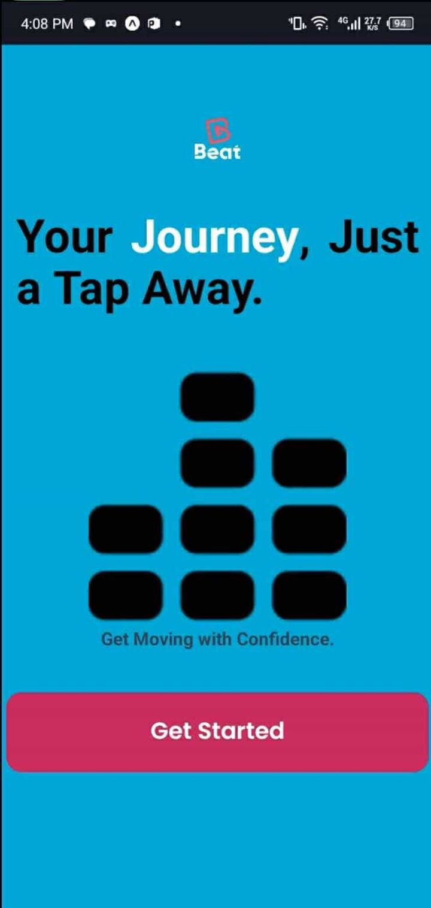
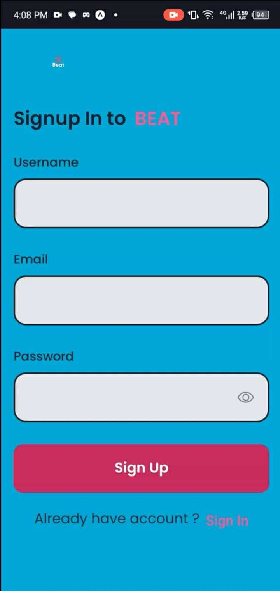
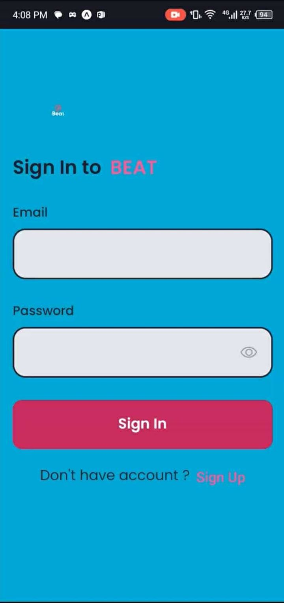

# BEAT
Beat Mobile App.

# Features
* Listen to your favorite music
* Message other artist
* Rate others music
* Search other music or artist

# Course Overview
* Basic React Native Components
* Database Design using Appwrite
* User Registration & Authenticaiton
* Deployment

# Tech Stack
* React Native
* AppWrite
* HTML, CSS and JS

# Home Screen
  

# Sign Up Screen
  

# Sign In Screen
  

# Tabs Screen
  

# Walkthrough of Beat Mobile App
* In this video I will show you the code and the app.
* https://youtu.be/p2_asNeOoj8?si=i0-W0i6rUWT2rwjB
## Screens
* Onboarding Screen
* Sign in Screen
* Sign up Screen